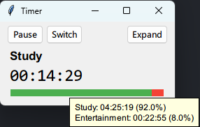
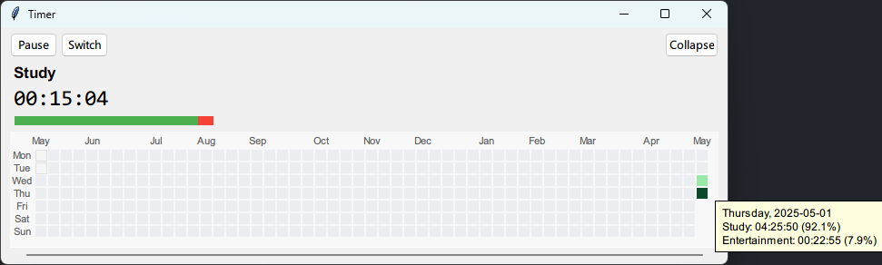

# StudyFun Timer

StudyFun Timer is a simple timer for tracking and visualizing your daily study and entertainment time. It features a simple and intuitive interface, and a GitHub-style heatmap to display your time distribution over the past year. It allows you to compare study and entertainment durations, and review your habits with detailed visual feedback. All data is stored locally.

